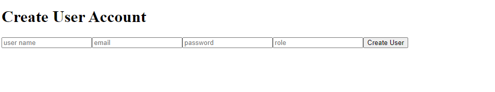
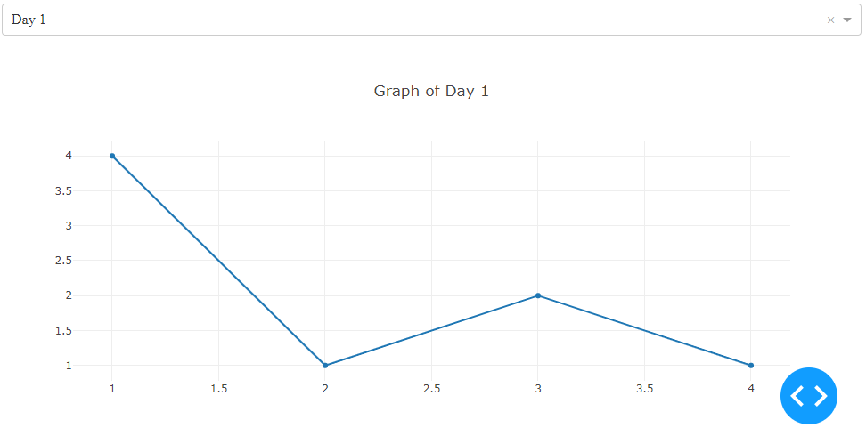
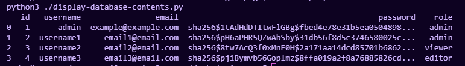

# Dash Auth Page

Add authentication and user management to your dash app. 

## Description

This adds a user database and login page on front of your Dash app. 

You can import users from a csv file, or create them in the app itself by signing in as an admin user and going to the `/create` page.

## What Does It Look Like

The log in page:


## Roles and Access Management

There is a provision made for 'roles', currently there is just 'admin', but using the same routing 
tree (the if/elif/else found in main.py) you could make as many roles as needed for restricting access
to any of the directories.

Here we limit access to the `/create` path to just admins, but the same logic applies to any number of roles and pages.

```python
    if pathname == f'{url_prefix[:-1]}/create':
        if current_user.is_authenticated:
            user = Users.query.filter_by(id=current_user.id).first()
            if user.role == "admin":
                return create
            else:
                return 'User does not have admin permissions'
        else:
            return login
```

## Create User Page

This page is where you create users: `/create`

Roles is where you can specify the access level of the user. 

You can add as many access levels as you like, but the built in one is 'admin' or 'default'.



## Other Pages

After logging in user will see this page:


After selecting a dash that is only available to a logged in user, they will see this page:




## How To Run This Example
_Must be run in Linux terminal, requires make_

The [makefile](./makefile) contains all the commands needed to set up and run the example dash app.


First we need to set the admin password in the [makefile](./makefile) 

This password will be used ad the first user login for the system, from which other users are created.


Create a database for users:
```bash
make create-database
```


Run the dash:
```bash
make run
```

Now you can open the dash to see the login page.


You can create users here: `/create`


## Other Useful Functions

Load a csv of users into the database.

The filename of the csv this loads can be edited in the [makefile](./makefile).

```bash
make load-users-csv
```

Check the contents of the user database:
```bash
make display-database
```

It will print a list like this:



